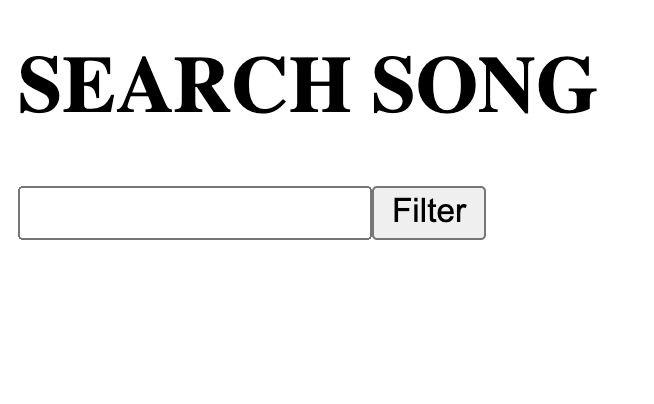
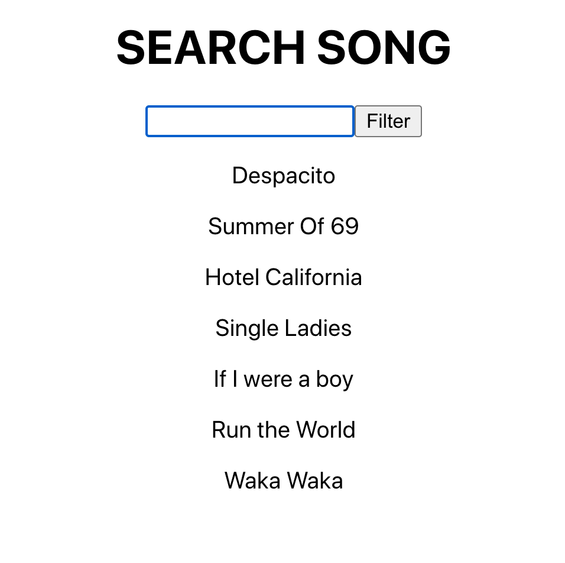
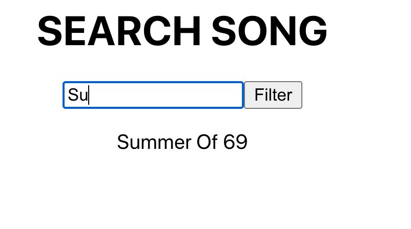

# React Song Filter App

## Setup

1. Make a fork of this repo
2. Clone your fork to your local development environment
3. Change to the project directory
4. Install dependencies: `yarn install`
5. Run the application: `yarn start`
6. Verify the application runs as expected

### What you should see

## Challenge
### This is a song filter challenge, you will build a playlist of your favourite songs and filter through them without a page refresh
1. In this challenge you will modify the class component App to filter songs
2. Create a state variable which is an array of songs
3. render a form input with a list of songs stored in the state variable
4. Search for a specific song in the form input
5. Notice as you type in the letters the song list must filter without a page refresh

**Note**: This challenge requires you to explore a bit about React events : https://reactjs.org/docs/handling-events.html

### <u>Final Output</u>

### Optional

1. Create Style components or add css to style the page
2. Also exlpore some of the react CSS frameworks such as
    1. https://material-ui.com/
    2. https://ant.design/
    3. https://react-bootstrap.github.io/

### Next level ( Advanced)
You can take this app to the next level and checkout if you could integrate any spotify api

## Tests and Submitting

At any time you can run `yarn test` to see your progress. By default it will run in `watch` mode, and you will have to press `q` to quit. It will run the automated tests against your code and let you know what your progress is so far. Once you have all the tests passing, you can submit your challenge. To do this make sure you have committed your work:

1. From the project root `git add .` and add all the files changed in this folder
2. Commit these files to your repository `git commit -m "challenge completed"`
3. Make sure your working tree is clear `git status`
4. Push these files to your github repository (master or main branch) `git push origin master`
5. Log on to Github and visit your fork of this challenge.
6. Make a pull request to the main branch.
7. Wait and watch the final tests run, if you are successful it will automatically let your educators know you are finished.

## Example solution
An example solution can be found in the challenge-complete branch of this repository.